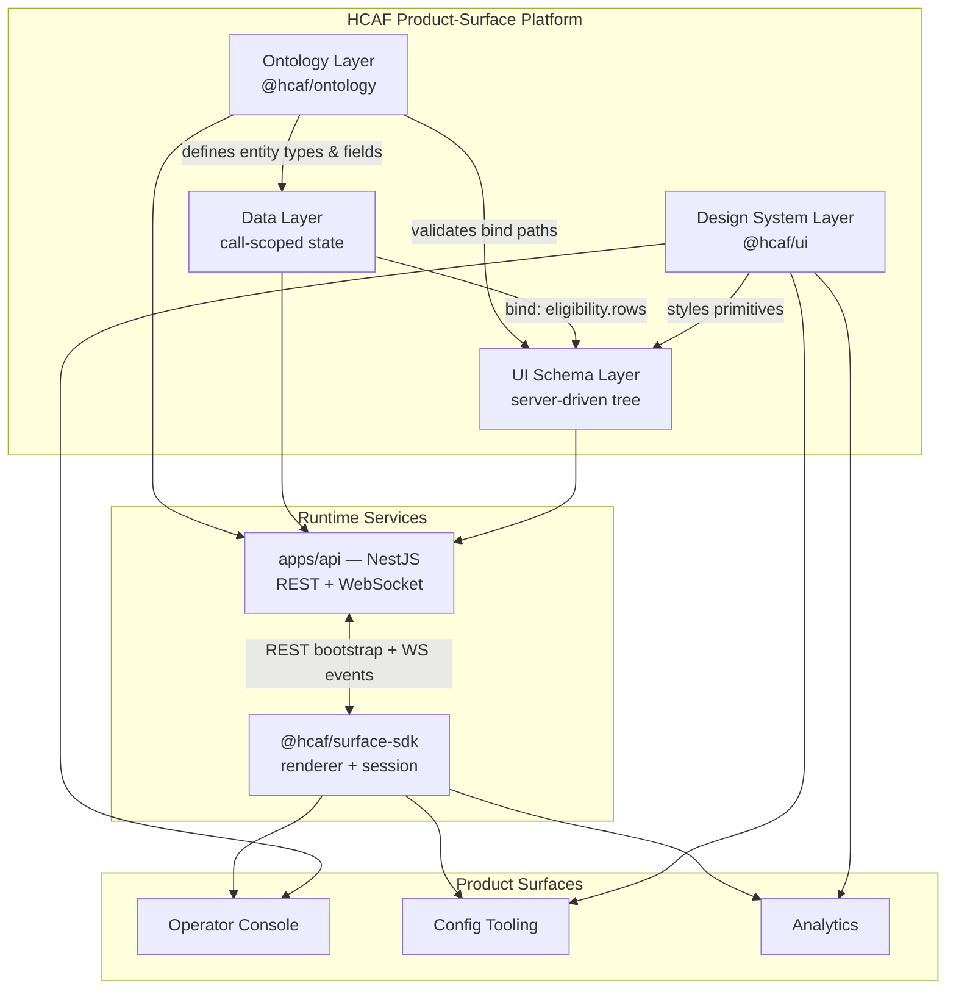
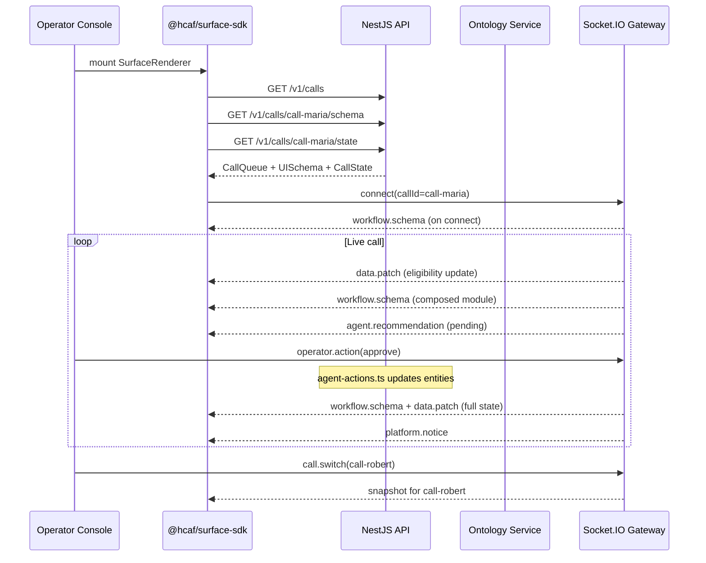

# HCAF Product-Surface Platform — Architecture Proposal

**Author:** Full-Stack / Product Engineer Exercise  
**Status:** Proposal (with working PoC)  
**Last updated:** July 2026

> **PoC vs proposal:** This document describes the target architecture and trade-offs. For what is **actually implemented** in this repository (custom `@hcaf/ui`, TanStack Query/Table, `@nestjs/config`, etc.), see [POC_IMPLEMENTATION.md](./POC_IMPLEMENTATION.md).

---

## Executive Summary

HCAF (Healthcare AI Fabric) powers multiple product surfaces—Operator Console, voice agents, configuration tooling, and analytics—that must share a common vocabulary, visual language, and real-time update model while the underlying healthcare ontology evolves weekly. Today these surfaces grew independently; operators on live calls pay the price in inconsistent UX, slow change cycles, and redeploy bottlenecks.

This proposal defines a **four-layer product-surface platform** that separates concerns cleanly:

1. **Ontology** — what entities and fields can exist
2. **Data** — what values exist for an active call
3. **UI schema** — how those values are laid out on screen (server-driven)
4. **Design system** — how it looks and feels (shared primitives)

The recommended stack is **Server-Driven UI (SDUI)** over a **WebSocket event channel**, rendered by a thin `@hcaf/surface-sdk`, styled with **`@hcaf/ui`** (PoC: custom CSS tokens; production: shadcn/ui optional). Frontends use **TanStack Query** for REST server state and **TanStack Table** for sortable grids. Schema and ontology changes propagate to connected clients without a frontend redeploy; data updates arrive as incremental JSON Patch operations.

A working proof-of-concept in this repository demonstrates the eligibility-check workflow on the Operator Console with **five concurrent patient calls**, **runtime schema composition** (layout advisor + composer), **server-driven workflow advancement**, live agent recommendations with **server-side approve/override execution**, and operator **override feedback** logged on the call — all pushed over WebSocket without a frontend redeploy.

**Recommended path:** Ship the platform in three ~1-week phases—foundation, real-time surfaces, production hardening—rather than attempting a big-bang rewrite of existing surfaces.

---


## 1. Problem Framing


### 1.1 Context

SpinSci's Operator Console is the hardest product surface: operators juggle patient demographics, provider details, eligibility rows, and AI agent recommendations during live phone calls. Seconds matter. The domain is not static—new payers, workflows, and entity types appear frequently, and EHR integrations vary by health system.

The exercise asks for an architecture that lets HCAF:

- Evolve ontology and workflows without redeploying React apps for every change  
- Deliver dense, low-latency UIs across multiple surfaces  
- Maintain visual and semantic consistency as the surface portfolio grows


### 1.2 Four-Layer Model

The platform deliberately separates **meaning**, **instances**, **layout**, and **presentation**. Each layer has a single owner and a versioned contract.




| Layer             | Package / service                             | Owns                                                     | Does not own                          |
| ----------------- | --------------------------------------------- | -------------------------------------------------------- | ------------------------------------- |
| **Ontology**      | `@hcaf/ontology`, `GET /v1/ontology`          | Entity types, field definitions, allowed values, version | Layout, styling, call-specific values |
| **Data**          | NestJS call state (`GET /v1/calls/:id/state`) | Instance values for an active session                    | How fields are displayed              |
| **UI schema**     | NestJS schema API + `@hcaf/surface-sdk`       | Component tree, `bind` paths, layout props               | Entity definitions, CSS               |
| **Design system** | `@hcaf/ui` (PoC: CSS custom properties; prod: shadcn/ui optional) | Visual primitives, density tokens, accessibility         | Business data shape                   |


### 1.3 The `bind` Path

Layers connect through **bind paths**—dot-notation references from UI schema nodes to data fields, validated against the ontology:

```
ontology.entities.eligibility.fields.status
         ↓
data.eligibility.rows[].status
         ↓
UISchema: { type: "EligibilityTable", bind: "eligibility.rows", props: { columns: ["status", ...] } }
         ↓
@hcaf/ui DataTable renders status column with Badge variant
```

When ontology extends (e.g., adding `priorAuth`), the backend pushes a new schema version; generic `Field` and `Panel` primitives render new bindings without a frontend release.

---


## 2. Technology Choices and Justifications


### 2.1 Server-Driven UI (SDUI) — Recommended

**Choice:** Backend owns a versioned UI schema tree; the frontend is a renderer with a fixed component registry.

**Why SDUI fits HCAF:**


| Requirement              | How SDUI addresses it                                                     |
| ------------------------ | ------------------------------------------------------------------------- |
| Ontology evolves weekly  | New fields and panels ship as schema JSON, not React PRs                  |
| Multiple surfaces        | Same schema contract serves OC, config tools, and headless consumers      |
| Workflow experimentation | Product can A/B layout changes per health system without app store cycles |
| Agent-driven UI          | AI runtime can emit schema fragments alongside recommendations            |


**Trade-off:** SDUI adds a schema contract to maintain and limits UI to registered component types. We accept this in exchange for change velocity. See [Trade-Off Sumimary](#7-trade-off-summary) and [Appendix B](#appendix-b-trade-off-records).

**PoC evidence:** Workflow modules surface automatically; the server composes each panel from entity data shape. Config Tooling can surface modules and extend ontology without redeploying the console. Approve/Override execute real state changes in `agent-actions.ts`. See [SCHEMA_COMPOSITION.md](./SCHEMA_COMPOSITION.md) and [SDUI_AND_AGENT_MODEL.md](./SDUI_AND_AGENT_MODEL.md).

### 2.1a What SDUI avoids (and what it does not)

**No Operator Console redeploy** for: new workflows, new entity fields, layout changes, or brand-new health-system workflows — the server sends composed JSON; the thin renderer displays it.

The **component registry** is a stable vocabulary of ~15 primitives (`Field`, `DataTable`, `Timeline`, …) — like HTML tags, not one React screen per workflow. New entities use `field-grid` fallback when data shape does not match a named strategy.

| Situation | Code change? |
|-----------|--------------|
| New workflow / entity / fields | No — config + server compose |
| Data shape → existing layout strategy | No |
| Novel visualization primitives cannot express | Yes — rare registry addition |

`eligibility-workflow.ts` is **PoC seed data**; production workflows live in a config store or are triggered by the agent runtime. Full explanation: [SDUI_AND_AGENT_MODEL.md](./SDUI_AND_AGENT_MODEL.md).

### 2.1b Agent governance — approve, override (rejection), audit

The AI agent proposes actions; operators **approve** (accept) or **override** (reject with mandatory feedback). While a recommendation is `pending`, workflow advancement pauses. Override events log to `agent.feedbackLog` and appear in Analytics. Server executes state changes in `agent-actions.ts` — not a client-side button flip.

### 2.2 Real-Time WebSockets — Recommended

**Choice:** Socket.IO over WebSocket for bidirectional call-scoped events, with REST for initial bootstrap.

**Why WebSockets fit HCAF:**

- **Live calls:** Eligibility status, agent recommendations, and operator actions must appear in sub-second time; polling is wasteful and adds latency.
- **Bidirectional:** Operators send `operator.action` (approve, override); the server broadcasts `data.patch` to all clients on the call room.
- **Schema push:** `workflow.schema` events deliver layout changes to connected consoles instantly.
- **Incremental updates:** JSON Patch (`data.patch`) avoids re-sending full call state on every tick.

**Transport envelope (PoC):**

```json
{ "type": "workflow.schema | data.patch | agent.recommendation | ontology.updated", "payload": { ... } }
```

**REST bootstrap:** On connect, clients fetch `GET /v1/calls/:callId/schema` and `GET /v1/calls/:callId/state`, then subscribe to the `callId` room for live events.

### 2.3 Design System — PoC and Production Path

**PoC choice:** `@hcaf/ui` with **CSS custom properties** (`--hcaf-*`), compact/comfortable density classes, and inline-styled primitives (`Button`, `Badge`, `Card`, `DataTable`, `Field`, …). `DataTable` uses **TanStack Table** for sortable columns.

**Production recommendation:** adopt **shadcn/ui** patterns (Radix primitives, Tailwind tokens, copy-paste ownership) on top of the same HCAF token file — the PoC deliberately avoids Tailwind to keep the exercise scope focused on SDUI and API design.

**Density default:** `hcaf-ui--compact` (12px base, tight table padding) for Operator Console; `comfortable` available for config and analytics surfaces.

### 2.4 Supporting Stack


| Concern      | Choice              | Rationale                                                             |
| ------------ | ------------------- | --------------------------------------------------------------------- |
| Monorepo     | pnpm + Turborepo    | Shared packages (`ontology`, `ui`, `surface-sdk`, `api-client`)       |
| API          | NestJS + `@nestjs/config` | Modular domains, env-based config, WebSocket gateway              |
| Frontend     | React + Vite + TanStack Query | Server state, caching, mutations; familiar React model        |
| Tables       | TanStack Table      | Sortable `DataTable` in `@hcaf/ui` and SDUI registry                  |
| Patch format | RFC 6902 JSON Patch | Standard, small payloads, library support (`fast-json-patch`)         |
| CI / Deploy  | GitHub Actions      | `pnpm build` on PR; Railway (API) + Vercel (frontends) on `main`      |


---


## 3. API and SDK Design


### 3.1 Package Topology

```
packages/
  ontology/          @hcaf/ontology     — entity/field definitions, bind validation
  ui/                @hcaf/ui           — design system primitives
  surface-sdk/       @hcaf/surface-sdk  — session client, renderer, registry

apps/
  api/               NestJS REST + Socket.IO gateway
  operator-console/  Live call surface (compact)
  config-tool/       Ontology + workflow config (comfortable)
  analytics/         Cross-call metrics + override audit log
```


### 3.2 REST API


| Method | Endpoint                                           | Purpose                                                        |
| ------ | -------------------------------------------------- | -------------------------------------------------------------- |
| `GET`  | `/v1/calls`                                        | Patient queue (all active calls)                               |
| `GET`  | `/v1/ontology?callId=`                             | Current ontology for a call (entities grow as modules surface) |
| `GET`  | `/v1/calls/:callId/schema`                         | UI schema for the active workflow                              |
| `GET`  | `/v1/calls/:callId/state`                          | Call-scoped data snapshot                                      |
| `GET`  | `/v1/workflows/eligibility-check/progress?callId=` | Active workflow modules for a call                             |
| `GET`  | `/v1/schema/compose/:moduleId`                     | Preview composed schema + layout reasoning                     |
| `GET`  | `/v1/schema/strategies`                            | List layout strategies                                         |
| `POST` | `/v1/admin/advance-scenario?callId=`               | *(dev/demo)* Force next workflow module                        |
| `POST` | `/v1/admin/reset?callId=`                          | *(dev/demo)* Reset call to initial seed                        |
| `POST` | `/v1/admin/push-schema?callId=`                    | *(dev/demo)* Alias for advance-scenario                        |
| `POST` | `/v1/admin/extend-ontology?callId=`                | *(dev/demo)* Alias for advance-scenario                        |
| `POST` | `/v1/config/surface-module`                        | Surface a workflow module on a call (Config Tooling)           |
| `POST` | `/v1/config/ontology/field`                        | Add ontology field + push to call                              |
| `GET`  | `/v1/analytics/summary`                            | Cross-call metrics + operator override audit log               |


Production would gate admin endpoints behind auth and replace in-memory stores with persistent workflow configuration.

### 3.3 WebSocket Events

**Client → server:**


| Event             | Payload                                                 | Behavior                                                                              |
| ----------------- | ------------------------------------------------------- | ------------------------------------------------------------------------------------- |
| `operator.action` | `{ action: "approve" | "override", feedback?: string }` | Executes scenario handler; updates entities; re-composes panel; broadcasts full state |
| `call.switch`     | `{ callId: string }`                                    | Leave current room; join new call room; send snapshot                                 |


**Server → client:**


| Event                  | Payload                                    | Behavior                     |
| ---------------------- | ------------------------------------------ | ---------------------------- |
| `workflow.schema`      | `UISchema`                                 | Replace rendered layout tree |
| `data.patch`           | `Operation[]` (JSON Patch or full replace) | State update                 |
| `agent.recommendation` | `AgentRecommendation`                      | New or updated AI suggestion |
| `ontology.updated`     | `{ version, label? }`                      | Ontology version bump        |
| `workflow.progress`    | `{ callId, activeModules, modules }`       | Workflow step progress       |
| `call.queue`           | `{ calls: CallQueueItem[] }`               | Patient queue update         |
| `platform.notice`      | `{ message, layoutStrategy?, composed? }`  | Operator-visible notice bar  |


Connection joins a room keyed by `callId` query parameter: `io(WS_URL, { query: { callId } })`.

### 3.4 `@hcaf/surface-sdk` Public API

```typescript
// Types
interface UISchema { version, ontologyVersion, workflowId, root: UISchemaNode }
interface CallState { patient, provider, eligibility, agent, priorAuth?, referral?, cob?, ... }
interface OperatorFeedback { action, feedback?, timestamp, moduleId }

// Session (optional abstraction over raw Socket.IO)
createSurfaceSession({ apiUrl, wsUrl, callId })
  .fetchSchema() / .fetchState() / .fetchCallQueue() / .connect()
  .on('workflow.schema' | 'data.patch' | 'call.queue' | ..., handler)
  .sendOperatorAction(action, feedback?)   // override requires feedback (min 3 chars)
  .switchCall(callId)

// Rendering
SurfaceRenderer({ schema, data, onAction, registry? })
defaultRegistry  // Stack, Panel, Field, PatientHeader, EligibilityTable, AgentRecommendation, ...

// Utilities
applyDataPatch(state, operations: Operation[]): CallState
resolveBind(data, bindPath): unknown
```

**Extension model:** Surfaces register custom components in `registry` for domain-specific widgets (e.g., `OnCallSchedule`, `PagingWidget`) while reusing generic `Field`/`Panel` for ontology-driven content.

**Versioning:** `UISchema.version` and `UISchema.ontologyVersion` are displayed in the console header. Clients reject or warn on unsupported major versions; minor versions are backward-compatible additions.

---


## 4. UX Quality


### 4.1 Information Density

Operator Console targets **high density without clutter**:

- **Compact tokens:** 12px base font, 6px/8px table cell padding, uppercase 11px section headers  
- **Grid layouts:** Patient and provider cards use 3–4 column grids to surface key identifiers above the fold  
- **Status encoding:** Color-coded `Badge` components for eligibility status (active/pending/denied) reduce scan time  
- **Progressive disclosure:** Agent recommendation actions (Approve / Override) appear when status is `pending`; Override requires feedback text before submit  
- **Multi-call queue:** Sidebar lists concurrent patients; switching calls hydrates that call's independent schema/state

Future surfaces (analytics, config) use `hcaf-ui--comfortable` density without forking components.

### 4.2 Latency Budgets

During a live call, perceived responsiveness directly affects operator trust and handle time.


| Interaction                        | Target (p95)              | Mechanism                                                                             |
| ---------------------------------- | ------------------------- | ------------------------------------------------------------------------------------- |
| Initial page load (schema + state) | < 500 ms                  | Parallel REST fetches; CDN for static assets                                          |
| WebSocket connect + first event    | < 300 ms                  | Sticky sessions; edge-adjacent API                                                    |
| Data patch apply → paint           | < 100 ms                  | JSON Patch to local state; React reconciliation only on changed paths                 |
| Agent recommendation display       | < 200 ms from server emit | Push over WS; no poll interval                                                        |
| Operator action feedback           | < 300 ms server-confirmed | No optimistic UI — server pushes full state replace after `agent-actions.ts` executes |
| Schema hot-swap                    | < 300 ms                  | Full tree replace when new workflow module composes                                   |
| Next module after operator acts    | ~3 s                      | Workflow resumes after approve/override                                               |


The PoC simulator emits eligibility patches every ~3 seconds, advances workflow modules every ~7 seconds per call (paused while agent status is `pending`), and staggers initial module surfacing on boot.

### 4.3 Resilience UX

- **Connection status:** `StatusDot` shows `connecting` / `live` / `offline`  
- **Offline bootstrap:** REST endpoints provide full snapshot if WebSocket drops; client reconnects and re-joins room  
- **Unknown components:** Registry falls back to `Unknown` placeholder rather than crashing the surface  
- **Schema change notice:** Banner confirms "UI schema updated — no frontend redeploy"

---


## 5. Deployment and Operations


### 5.1 No-Redeploy Change Path

The platform supports three change velocities:


| Change type            | What changes               | Frontend redeploy?                     | Backend redeploy?        |
| ---------------------- | -------------------------- | -------------------------------------- | ------------------------ |
| **Data only**          | Call field values          | No                                     | No (runtime state)       |
| **Schema only**        | Layout, bindings, columns  | **No**                                 | Config publish only      |
| **Ontology extension** | New entity/fields + schema | **No** (if generic primitives suffice) | Ontology registry update |
| **New component type** | New `type` in registry     | **Yes** (SDK/surface release)          | Optional                 |


The **schema-only path** is the primary operational win: workflow engineers publish a new `UISchema` version to a configuration store; the API broadcasts `workflow.schema` to connected clients. No Vercel deploy, no app store review.

```
┌─────────────────┐     publish      ┌──────────────────┐
│ Workflow Config │ ───────────────► │ Schema Registry  │
│ (Git / DB)      │                  │ (versioned)      │
└─────────────────┘                  └────────┬─────────┘
                                              │ workflow.schema (WS)
                                              ▼
                                     ┌──────────────────┐
                                     │ Operator Console │
                                     │ (static bundle)  │
                                     └──────────────────┘
```


### 5.2 Deployment Topology


| Artifact                                          | Target                        | Cadence                               |
| ------------------------------------------------- | ----------------------------- | ------------------------------------- |
| `operator-console` static build                   | Vercel / CloudFront           | Monthly or on new registry components |
| `apps/api` container                              | Railway / ECS                 | Weekly or on API contract changes     |
| `@hcaf/ontology`, `@hcaf/ui`, `@hcaf/surface-sdk` | npm private registry          | Per surface adoption                  |
| Workflow schemas + ontology                       | Config service / object store | **Daily or ad hoc**                   |


### 5.3 CI/CD

- **CI:** `pnpm install` → `pnpm build` on every PR (Turborepo builds packages in dependency order)  
- **Deploy:** Separate pipelines for API (container) and frontend (static); schema/ontology publishes bypass both


### 5.4 Observability

- Trace IDs propagated from API through WebSocket events (`o11y` headers in production)  
- Metrics: WS connection count per call, schema version distribution, patch latency histogram  
- Alerts: p95 patch-to-paint > 200 ms, WS disconnect rate > 5%

---


## 6. Implementation Timeline (~3 Weeks)

Phased delivery de-risks the platform and produces demoable milestones for stakeholder reviews.

### Week 1 — Foundation


| Deliverable            | Outcome                                                       |
| ---------------------- | ------------------------------------------------------------- |
| `@hcaf/ontology` v1    | Patient, provider, eligibility, agent entities                |
| `@hcaf/ui` v0          | Custom CSS tokens, TanStack Table DataTable, Button, Badge, Card, Field |
| `@hcaf/surface-sdk` v0 | `SurfaceRenderer`, `defaultRegistry`, `applyDataPatch`        |
| NestJS REST            | `/v1/ontology`, `/v1/calls/:id/schema`, `/v1/calls/:id/state` |
| Operator Console shell | Bootstrap fetch, static render of eligibility workflow        |


**Milestone:** Render eligibility check from REST-only; no WebSocket yet.

### Week 2 — Real-Time Surfaces


| Deliverable            | Outcome                                                            |
| ---------------------- | ------------------------------------------------------------------ |
| Socket.IO gateway      | Room-based events, operator actions                                |
| Live simulator         | Eligibility patches (~~3s) + workflow auto-advance (~~7s per call) |
| Runtime composition    | Layout advisor + schema composer for 10 module types               |
| Agent action execution | Approve/Override with server-side handlers + override feedback     |
| Multi-patient queue    | 5 concurrent calls with `call.switch`                              |


**Milestone:** End-to-end live call demo with auto-composed modules and real operator actions (PoC as shipped).

### Week 3 — Production Hardening


| Deliverable                  | Outcome                                                |
| ---------------------------- | ------------------------------------------------------ |
| AuthN/Z                      | Operator SSO, call-scoped authorization                |
| Persistent stores            | Schema registry, ontology versioning in DB             |
| Schema validation            | Bind path validation against ontology on publish       |
| Error boundaries + fallbacks | Graceful degradation per component                     |
| CI/CD + staging              | Deploy pipelines, load test WS at 500 concurrent calls |
| Documentation                | ADRs in `TRADEOFFS.md`, surface onboarding guide       |


**Milestone:** Staging environment ready for pilot health system; stakeholder sign-off on Phase 2 surfaces.

---


## 7. Trade-Off Summary


| Decision            | Recommended                  | Runner-up                       | Why recommended wins                                                               |
| ------------------- | ---------------------------- | ------------------------------- | ---------------------------------------------------------------------------------- |
| UI architecture     | **SDUI** (schema + registry) | Hardcoded React per workflow    | Weekly workflow changes; multi-surface reuse; no redeploy for layout               |
| UI architecture     | **SDUI**                     | Low-code builder (Retool-style) | Operators need sub-second custom UX; low-code adds runtime weight and less control |
| Real-time transport | **WebSocket (Socket.IO)**    | SSE + REST polling              | Bidirectional operator actions; lower latency than poll; room semantics            |
| Real-time transport | **WebSocket**                | GraphQL subscriptions           | Simpler ops envelope; JSON Patch is transport-agnostic                             |
| Design system (PoC) | **Custom `@hcaf/ui` + TanStack Table** | shadcn/ui + Tailwind (prod path) | PoC ships owned primitives; shadcn recommended for production scale |
| Design system (prod)| **shadcn/ui + Tailwind**     | Material UI                     | In-repo ownership, compact density, Radix a11y when team adopts shadcn |
| State updates       | **JSON Patch**               | Full state replace              | Bandwidth-efficient for dense eligibility tables                                   |
| Monorepo tool       | **pnpm + Turborepo**         | Nx                              | Sufficient for 3 packages + 2 apps; lower config overhead                          |
| API framework       | **NestJS**                   | Fastify raw                     | First-class WS gateway, module boundaries match domains                            |


For detailed ADR-style rationale, dissenting opinions, and revisit triggers, see [Appendix B](#appendix-b-trade-off-records).

---


## 8. Risk Assessment


| Risk                                                                             | Likelihood | Impact   | Mitigation                                                                              |
| -------------------------------------------------------------------------------- | ---------- | -------- | --------------------------------------------------------------------------------------- |
| **Schema contract drift** — frontend registry missing a `type` the backend emits | Medium     | High     | Schema validation on publish; `Unknown` fallback; CI contract tests between API and SDK |
| **Ontology breaking changes** — renamed fields break bind paths                  | Medium     | High     | Versioned ontology; deprecation window; automated bind-path linter                      |
| **WebSocket scale** — thousands of concurrent calls per region                   | Medium     | Medium   | Horizontal API pods + Redis adapter for Socket.IO; connection limits per operator       |
| **SDUI expressiveness ceiling** — complex interactions don't map to primitives   | High       | Medium   | Escape hatch: register native React components; not everything must be schema-driven    |
| **shadcn maintenance** — upstream component updates                              | Low        | Low      | Copy-paste ownership; pin versions; visual regression tests                             |
| **Latency regression** — large schema trees slow initial render                  | Low        | Medium   | Schema size budgets; lazy-mount panels; virtualize tables                               |
| **Security** — schema injection or cross-call data leak                          | Low        | Critical | Auth on WS handshake; call-scoped rooms; schema publish RBAC                            |
| **Adoption friction** — teams prefer hardcoded React                             | Medium     | Medium   | Pilot on eligibility workflow only; measure change lead time vs. control                |
| **EHR variance** — ontology can't capture all health-system shapes               | High       | Medium   | Extension entities per tenant; generic `Field` renderer for unknown types               |


---


## 9. End-to-End Architecture




---


## Appendix A: PoC Run Instructions


### Prerequisites

- Node.js 20+
- pnpm 9.x (`corepack enable` recommended)


### Start the monorepo

```bash
pnpm install
pnpm dev
```

Turborepo starts both apps in parallel:


| Service                    | URL                                            |
| -------------------------- | ---------------------------------------------- |
| **Operator Console**       | [http://localhost:5173](http://localhost:5173) |
| **API (REST + WebSocket)** | [http://localhost:3001](http://localhost:3001) |


### Demo flow

1. Open [http://localhost:5173](http://localhost:5173) — five patients appear in the left queue; default call is `call-maria`.
2. Observe the **Live call** status dot and schema/ontology version in the header.
3. Wait for a workflow module to surface automatically — each patient gets a different shuffled module order and personalized data.
4. When agent recommendation status is **pending**, click **Approve** — server executes the scenario handler, updates entity state, re-composes the panel, and pushes full state (no optimistic client update).
5. Click **Override** — enter feedback (3+ chars), submit — server logs to `agent.feedbackLog`, applies override handler, shows outcome.
6. Switch patients in the sidebar — each call evolves independently via `call.switch`.
7. ~3 seconds after an operator action, the next module may surface for that call.


### Useful API endpoints

```bash
curl http://localhost:3001/v1/calls
curl http://localhost:3001/v1/ontology?callId=call-maria
curl http://localhost:3001/v1/calls/call-maria/schema
curl http://localhost:3001/v1/calls/call-maria/state
curl http://localhost:3001/v1/schema/compose/priorAuth
curl -X POST 'http://localhost:3001/v1/admin/advance-scenario?callId=call-maria'
curl -X POST 'http://localhost:3001/v1/admin/reset?callId=call-maria'
```


### Repository layout (reference)

```
packages/ontology/       @hcaf/ontology
packages/ui/             @hcaf/ui
packages/surface-sdk/    @hcaf/surface-sdk
apps/api/                NestJS REST + WebSocket
apps/operator-console/   React + Vite
```

---


## Appendix B: Trade-Off Records

Detailed Architecture Decision Records (ADRs) for the choices summarized in [Section 7](#7-trade-off-summary) are maintained in:

**[docs/TRADEOFFS.md](./TRADEOFFS.md)**

That document covers SDUI vs. hardcoded React, WebSocket vs. polling, shadcn/ui vs. alternatives, JSON Patch vs. full-state sync, and ontology modeling approaches—with context, decision, consequences, and revisit triggers for each.

---


## Related Documents

- [HCAF.md](./HCAF.md) — Company and platform context  
- [ONTOLOGY.md](./ONTOLOGY.md) — Ontology layer deep-dive  
- [SCHEMA_COMPOSITION.md](./SCHEMA_COMPOSITION.md) — Runtime schema composition pipeline  
- [SDUI_AND_AGENT_MODEL.md](./SDUI_AND_AGENT_MODEL.md) — SDUI mental model + agent approve/override governance  
- [TRADEOFFS.md](./TRADEOFFS.md) — ADR-style trade-off records  
- [DISCUSSION_GUIDE.md](./DISCUSSION_GUIDE.md) — Multi-stakeholder conversation playbook

