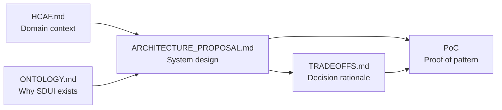
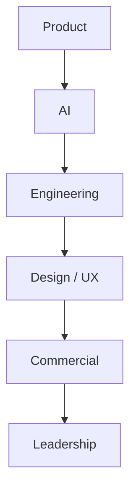

# HCAF Exercise — Multi-Stakeholder Discussion Guide

A call playbook for the SpinSci **Healthcare AI Fabric (HCAF)** Full-Stack / Product Engineer exercise. Use this document to prepare for and run stakeholder conversations about your architecture proposal and PoC.

**Core premise:** There is no single correct answer. HCAF is evaluating how you reason through trade-offs, communicate a coherent technical vision, and navigate competing priorities across Commercial, Product, AI, Engineering, Design/UX, and Leadership.

---

## 1. Exercise intent — what HCAF evaluates

HCAF is not grading you on shipping production software. They are assessing whether you can operate as a **product-minded engineer** on a platform where:

- The **ontology evolves** — new payers, workflows, and entity types appear frequently
- **Data is dense** — operators see patient, provider, eligibility, and agent output simultaneously during live calls
- **Latency is critical** — UI must update in seconds, not after a frontend deploy
- **Multiple surfaces lack a shared pattern** — Operator Console, config tooling, and analytics grew independently
- **Visual consistency is an open problem** — no professional-grade design system exists yet

### What success looks like in the calls

| Dimension | What they're listening for |
|-----------|---------------------------|
| **Trade-off reasoning** | You name options, articulate costs/benefits, recommend with conditions — not "SDUI is always best" |
| **Technical coherence** | Ontology, UI schema, design system, real-time transport, and deploy model fit together as a story |
| **Stakeholder fluency** | You adapt the same architecture to what Commercial cares about vs. what Engineering cares about |
| **Domain awareness** | You understand healthcare operations (live calls, EHR integration, operator workflows) even when details are unknown |
| **Intellectual honesty** | You state what the PoC proves, what it does not prove, and when you'd pivot |
| **Dialogue, not monologue** | You ask clarifying questions and incorporate pushback instead of defending a slide deck |

### What they are not evaluating

- Pixel-perfect UI polish
- Production-scale infra (multi-region, HIPAA audit trail, full FHIR alignment)
- Whether your exact technology choices match their current stack
- Speed of coding during the exercise window

---

## 2. How to use the doc package

Your deliverable is a **package of artifacts**, not a single document. Each piece serves a different audience and moment in the conversation.

| Document | Primary audience | When to use it | What to point to |
|----------|------------------|----------------|------------------|
| [HCAF.md](./HCAF.md) | Everyone (opening context) | First 2 minutes of any call | Platform diagram, Operator Console problem, why the exercise exists |
| [ONTOLOGY.md](./ONTOLOGY.md) | AI, Product, Engineering | When data shape / evolution comes up | Four-layer model, `bind` paths, versioning scenarios A & B |
| [ARCHITECTURE_PROPOSAL.md](./ARCHITECTURE_PROPOSAL.md) | Engineering, Leadership | Deep technical walkthrough | System diagram, API contracts, package boundaries, real-time flow |
| [SCHEMA_COMPOSITION.md](./SCHEMA_COMPOSITION.md) | Engineering, AI | When runtime layout composition comes up | Layout advisor, 7 strategies, compose pipeline |
| [SDUI_AND_AGENT_MODEL.md](./SDUI_AND_AGENT_MODEL.md) | AI, Product, Commercial | SDUI value prop + agent human-in-the-loop | What avoids redeploy; override = rejection with audit |
| [TRADEOFFS.md](./TRADEOFFS.md) | Engineering, Leadership, Product | When challenged on a specific choice | ADR-style records: SDUI vs hardcoded React, ontology registry vs graph DB, etc. |
| **PoC** (`pnpm dev`) | All stakeholders (especially Product, Design) | Demo segment of every call | Auto-composed modules, agent actions, multi-patient queue |

### Suggested reading order (for you, night before)

1. [HCAF.md](./HCAF.md) — anchor on domain and constraints
2. [SDUI_AND_AGENT_MODEL.md](./SDUI_AND_AGENT_MODEL.md) — **SDUI mental model + agent governance** (approve / override / audit)
3. [ONTOLOGY.md](./ONTOLOGY.md) — four-layer model; most questions trace back here
4. [ARCHITECTURE_PROPOSAL.md](./ARCHITECTURE_PROPOSAL.md) — full system story
5. [TRADEOFFS.md](./TRADEOFFS.md) — "when we'd pivot" ammunition
6. Run the PoC: console → config surface module → approve/override → analytics audit log

### How artifacts reinforce each other



**Rule of thumb:** Lead with *outcome* (operator experience, time-to-market), support with *architecture*, defend with *trade-offs*, validate with *demo*.

---

## 3. Trade-off framing template

Use this structure for every major decision — in writing ([TRADEOFFS.md](./TRADEOFFS.md)) and verbally in calls. Practicing it out loud prevents rambling.

### Template

```
Context     → What constraint or stakeholder need forces a decision?
Options     → What are 2–4 viable approaches? (Include "do nothing" or "defer")
Trade-off   → What does each option gain and cost? (Be specific: velocity, risk, ops, UX)
Recommend   → What do you propose *for HCAF's current stage*, and why?
Pivot       → Under what signal would you change course?
```

### Worked example: Server-Driven UI (SDUI)

| Step | Content |
|------|---------|
| **Context** | Workflows and entity fields change weekly; operators cannot wait for a React release during a live eligibility call. |
| **Options** | (A) Hardcoded React screens per workflow; (B) Low-code builder; (C) SDUI with generic primitives + component registry; (D) Hybrid — SDUI for volatile workflows, hardcoded for stable chrome. |
| **Trade-off** | (A) Fast for one workflow, brittle at scale. (B) Empowers non-engineers, hard to enforce a11y/density. (C) Requires platform investment upfront, pays off across OC + config + analytics. (D) Pragmatic but adds two mental models. |
| **Recommend** | (C) with a small registry of domain composites (e.g. `PatientHeader`, `EligibilityTable`) and generic fallbacks (`Field`, `Panel`) — as demonstrated in the PoC `SurfaceRenderer`. |
| **Pivot** | If workflow count stays &lt;5 for 12+ months and change cadence drops, revisit hardcoded screens for the stable subset. If non-engineers must own layout, invest in guarded low-code on top of the same schema contract. |

### Worked example: Ontology modeling

| Step | Content |
|------|---------|
| **Context** | EHR data shape varies by health system; new entities (e.g. `PriorAuth`) appear without warning. |
| **Options** | JSON Schema registry; graph DB (Neo4j); Protobuf/Avro; hardcoded TypeScript types. |
| **Trade-off** | See ADR-000 in [TRADEOFFS.md](./TRADEOFFS.md) and comparison table in [ONTOLOGY.md](./ONTOLOGY.md) §5. |
| **Recommend** | Versioned JSON Schema registry (`GET /v1/ontology`) for PoC and near-term — human-readable, validates `bind` paths in `@hcaf/surface-sdk`. |
| **Pivot** | If relationship traversal becomes the dominant query pattern (not rendering), evaluate graph storage behind the same API surface. |

---

## 4. Stakeholder lens table

Tailor your lead message per audience. The architecture stays the same; the emphasis shifts.

| Stakeholder | What they care about | Lead message | Likely pushback | Response frame |
|-------------|---------------------|--------------|-----------------|----------------|
| **Commercial** | Time-to-market for new health-system workflows; differentiation vs. competitors; sellable "platform" story | "We can onboard a new payer workflow without a frontend release — the server composes panels from entity data and pushes them over the wire while the operator is on a live call." | "Sounds complex / expensive to build. Will customers wait?" | "The complexity is front-loaded into a shared platform. Each new workflow is cheaper than the last. The PoC shows a prior-auth panel auto-composed from data shape — no redeploy." |
| **Product** | Operator outcomes; workflow flexibility; roadmap for multiple surfaces; agent-human handoff | "One platform serves Operator Console today and config/analytics tomorrow — same ontology vocabulary, same session model." | "Will SDUI limit what PMs can spec? Can we move fast on UX experiments?" | "PMs own *what* appears via UI schema; design system owns *how* it looks. Novel layouts still use the component registry — we are not banning custom UI, we are separating volatile layout from stable chrome." |
| **AI** | Agent output structure; confidence and actions; ontology alignment; real-time recommendations | "Agent recommendations bind to typed ontology fields; operators approve/override through the same WebSocket channel — and the server executes real state changes, not a button flip." | "Our models output unstructured text. How does that map to your schema?" | "Start with a structured envelope (`text`, `confidence`, `action`, `status`) — see `agent.latest` in the PoC. Override requires operator feedback logged to `agent.feedbackLog` for audit." |
| **Engineering** | Maintainability; package boundaries; testability; deploy independence; operational cost | "Monorepo: `@hcaf/ontology`, `@hcaf/ui`, `@hcaf/surface-sdk`, NestJS API, thin React shell. Schema/ontology changes do not require `operator-console` rebuild." | "SDUI is hard to debug. Registry becomes a bottleneck. WebSockets don't scale." | "Agree — that's why we keep a typed registry, versioned ontology, and JSON Patch for incremental state. At scale we'd add schema validation CI and consider SSE fallbacks; see [TRADEOFFS.md](./TRADEOFFS.md) for transport ADR." |
| **Design / UX** | Density, consistency, accessibility, operator cognitive load during live calls | "`@hcaf/ui` owns density tokens, status semantics, and compact tables — SDUI renders through design-system primitives, not raw HTML." | "Server-driven UI always looks generic. We need a real design system." | "Exactly — SDUI without a design system is a trap. Ontology says `status: denied`; the design system maps that to `Badge variant='danger'`. Custom composites (e.g. `PatientHeader`) encapsulate layout patterns." |
| **Leadership** | Strategic bet; build vs. buy; risk; team sizing; 12–18 month trajectory | "We are building a product-surface platform, not another one-off console. Upfront platform cost buys compounding velocity across SpinSci's surfaces." | "Why not buy a low-code tool or keep shipping React features?" | "Low-code can sit on top later if the schema contract is ours. One-off React does not compound — each new workflow duplicates EHR binding, real-time, and a11y work. We recommend platform now, selective hardcoding where stability is proven." |

---

## 5. Call-by-call playbook

### Suggested order

Run calls in an order that **builds your narrative** and surfaces risks early:



**Why this order:** Product and AI validate the problem framing. Engineering stress-tests feasibility. Design ensures the approach is operable for operators. Commercial and Leadership hear a refined story with risks already named.

Adjust if the scheduler dictates a different sequence — use the stakeholder lens table to re-weight emphasis.

---

### Call 1: Product (30–45 min)

**Goal:** Confirm the problem is worth solving and your platform scope matches their surface roadmap.

| Phase | Time | Flow |
|-------|------|------|
| Open | 3 min | "I framed this around the Operator Console as the hardest surface — dense data, live calls, seconds matter. Does that match how you prioritize surfaces today?" |
| Context | 5 min | Walk [HCAF.md](./HCAF.md) constraints: evolving ontology, no shared pattern across surfaces |
| Architecture | 10 min | Four layers from [ONTOLOGY.md](./ONTOLOGY.md): ontology → data → UI schema → design system |
| Demo | 8 min | PoC: 5-patient queue, wait for module + pending agent, approve (entity updates), override with feedback |
| Deep dive | 10 min | Runtime schema composition ([SCHEMA_COMPOSITION.md](./SCHEMA_COMPOSITION.md)): layout advisor picks strategy from data shape |
| Close | 5 min | "What workflow types are coming in the next two quarters that this model must absorb?" |

**Exit criteria:** They agree evolving data shape is a top constraint; they can name 1–2 workflows you'd need to support next.

---

### Call 2: AI (30–45 min)

**Goal:** Align on how agent output flows into operator UI and what "typed" means for recommendations.

| Phase | Time | Flow |
|-------|------|------|
| Open | 3 min | "How do agents currently deliver recommendations to operators — push, poll, or embedded in EHR?" |
| Agent contract | 10 min | `agent.latest` envelope; **Approve = accept**, **Override = reject** (mandatory feedback); `feedbackLog` audit; workflow pauses while `pending` |
| Ontology link | 10 min | [ONTOLOGY.md](./ONTOLOGY.md) — why bind paths need ontology validation before render |
| Demo | 8 min | Show pending → approve (server executes handler) → override with feedback textarea; mention `agent.feedbackLog` |
| Risks | 8 min | Hallucinated fields, version skew, unstructured model output |
| Close | 5 min | "What metadata do you wish operators saw alongside every recommendation?" |

**Exit criteria:** Shared agreement on minimum structured envelope for agent output; open question list for edge cases.

---

### Call 3: Engineering (45–60 min)

**Goal:** Stress-test package boundaries, APIs, real-time design, and deploy model.

| Phase | Time | Flow |
|-------|------|------|
| Open | 3 min | "I'll go deep on boundaries and trade-offs — please interrupt when something doesn't scale for your stack." |
| System map | 12 min | [ARCHITECTURE_PROPOSAL.md](./ARCHITECTURE_PROPOSAL.md): monorepo layout, API routes, WebSocket gateway |
| Package tour | 10 min | `@hcaf/ontology`, `@hcaf/ui`, `@hcaf/surface-sdk`, `apps/api`, `apps/operator-console` |
| Real-time | 8 min | Event types: `workflow.schema`, `data.patch`, `ontology.updated`; JSON Patch vs full state |
| Trade-offs | 12 min | [TRADEOFFS.md](./TRADEOFFS.md) — SDUI, ontology registry, transport, deploy |
| Demo | 8 min | Multi-patient queue, auto-composed modules, `curl /v1/schema/compose/:moduleId` |
| Close | 5 min | "What would you need to see in CI before trusting schema changes in production?" |

**Exit criteria:** They can diagram the data flow; at least one concern is captured with a pivot condition.

---

### Call 4: Design / UX (30–45 min)

**Goal:** Prove SDUI and design system are complementary, not opposing forces.

| Phase | Time | Flow |
|-------|------|------|
| Open | 3 min | "Operators need density and consistency under stress — how do you think about that today?" |
| Separation of concerns | 8 min | Ontology = semantics; UI schema = layout; `@hcaf/ui` = presentation ([ONTOLOGY.md](./ONTOLOGY.md) §6) |
| Design system | 10 min | Compact mode (`hcaf-ui--compact`), `Badge` variants, `DataTable`, semantic tokens |
| Demo | 10 min | Same PoC — focus on readability, status colors, action buttons, not backend |
| Gaps | 8 min | What SDUI cannot do: novel visualizations, marketing polish, complex interactions |
| Close | 5 min | "If you owned `@hcaf/ui`, what are the first three components every surface would require?" |

**Exit criteria:** Design agrees platform primitives + registry is viable; list of must-have components captured.

---

### Call 5: Commercial (20–30 min)

**Goal:** Translate architecture into customer-facing velocity and platform differentiation.

| Phase | Time | Flow |
|-------|------|------|
| Open | 2 min | "I'll keep this outcome-focused — happy to go technical if useful." |
| Value prop | 8 min | Faster health-system workflow onboarding; one platform under all surfaces |
| Demo | 8 min | Prior-auth module surfaces automatically — "new workflow live without shipping a new console build" |
| Objections | 8 min | Complexity, services engagement, competitor comparisons |
| Close | 5 min | "Which customer workflow stories would be most compelling in a sales cycle?" |

**Exit criteria:** Commercial can repeat the value prop in one sentence; you have their language for Leadership.

---

### Call 6: Leadership (20–30 min)

**Goal:** Strategic recommendation with explicit risks and investment framing.

| Phase | Time | Flow |
|-------|------|------|
| Open | 2 min | Elevator pitch: platform for all product surfaces, OC as proving ground |
| Problem | 5 min | [HCAF.md](./HCAF.md) — why one-off consoles do not compound |
| Recommendation | 8 min | SDUI + ontology + shared design system + real-time session model |
| Evidence | 5 min | PoC demo or 60-second recording if live demo risky |
| Risks & investment | 8 min | Platform team sizing, registry governance, what PoC does not prove |
| Close | 5 min | "What decision do you need from this exercise — hire, pilot, or further discovery?" |

**Exit criteria:** Clear ask and explicit "we would pivot if…" statements.

---

## 6. Key decisions cheat sheet

Quick reference for the five decisions most likely to surface. Full rationale lives in [TRADEOFFS.md](./TRADEOFFS.md).

### SDUI (Server-Driven UI)

| | |
|--|--|
| **Decision** | Backend sends UI schema tree; frontend renders via `@hcaf/surface-sdk` component registry |
| **Why** | Workflow layout changes without `operator-console` redeploy — demonstrated by auto-composed workflow modules |
| **Cost** | Registry governance, debugging indirection, schema migration discipline |
| **Pivot if** | Workflow count and change rate stay low; or guarded low-code can emit the same schema contract |

### Real-time transport

| | |
|--|--|
| **Decision** | WebSocket (Socket.IO in PoC) per call session; events for schema, data patches, agent output |
| **Why** | Operators need sub-second updates during live calls; bidirectional operator actions |
| **Cost** | Connection management, reconnect logic, horizontal scaling complexity |
| **Pivot if** | Measured p99 latency allows SSE for server→client only; or polling for non-live surfaces |

### Design system (`@hcaf/ui`)

| | |
|--|--|
| **Decision** | Shared package with density modes, semantic status tokens, primitives consumed by SDUI registry |
| **Why** | Visual consistency across OC, config, analytics without duplicating CSS per surface |
| **Cost** | Upfront component library investment; versioning across consuming apps |
| **Pivot if** | SpinSci adopts an external system (e.g. hospital-mandated) — wrap it behind `@hcaf/ui` API |

### Ontology layer (`@hcaf/ontology`)

| | |
|--|--|
| **Decision** | Versioned JSON Schema registry; `GET /v1/ontology`; bind-path validation in SDK |
| **Why** | Entity/field evolution is the root constraint — see [ONTOLOGY.md](./ONTOLOGY.md) |
| **Cost** | Version negotiation, drift between surfaces, not a full clinical data model |
| **Pivot if** | Relationship-heavy queries dominate → graph storage behind same API; production aligns with FHIR profiles |

### Deploy model

| | |
|--|--|
| **Decision** | Separate deploy paths: API (e.g. Railway) vs static console (e.g. Vercel); schema/ontology changes via API push, not frontend build |
| **Why** | Decouple volatile workflow logic from stable shell; see `.github/workflows/deploy.yml` |
| **Cost** | Two pipelines, environment coordination, cache invalidation for console assets |
| **Pivot if** | Schema changes require feature flags in the shell itself — tighten coupling consciously |

---

## 7. Questions to ask THEM

Turn calls into dialogue. These questions signal domain curiosity and expose assumptions.

### Product

- Which surfaces share the most workflow overlap with Operator Console in the next 12 months?
- How often does a new payer or workflow type land in production today — weekly, monthly, per customer?
- Who owns UI layout changes today — PM, solutions, engineering?
- What does a failed operator experience look like — data wrong, too slow, or too cluttered?

### AI

- What is the current contract between agent runtime and operator UI?
- Do recommendations arrive as structured actions, free text, or both?
- How do you handle operator override for model governance and audit?
- When ontology adds a field, how do agents learn it — retraining, prompt injection, or rules?

### Engineering

- What is the current deploy cadence for Operator Console vs. backend services?
- Do you already have a schema or config store, or is layout embedded in React today?
- What EHR integration patterns constrain real-time data — polling Epic, webhooks, batch?
- Where would you enforce schema validation — API gateway, CI, or client SDK?

### Design / UX

- What density and accessibility standards do hospital operators expect?
- Are there brand or customer white-label requirements across health systems?
- Which interactions must never be server-driven (e.g. keyboard shortcuts, drag-drop)?
- How do you prototype today — Figma only, or code prototypes?

### Commercial

- Which customer workflows are hardest to deliver today — and why?
- Do deals hinge on custom UI per health system or configurable workflows?
- What would "platform" mean in a customer-facing pitch vs. internal HCAF?

### Leadership

- Is the bet a new platform team, or evolving the existing console team?
- What is the tolerance for 6-month platform investment before visible feature velocity?
- Are there build-vs-buy pressures (low-code, iPaaS, EHR vendor widgets)?

---

## 8. Five-minute demo script

Map each beat to a stakeholder concern. Practice until this fits in 5 minutes with buffer for questions.

**Prereq:** `pnpm install && pnpm dev` — Console at http://localhost:5173, API at http://localhost:3001.

| Time | Action | Say (approx.) | Stakeholder hook |
|------|--------|---------------|------------------|
| 0:00 | Open Operator Console | "Five concurrent patients in the queue — each call has independent workflow state." | **Product** — realistic multi-call operator context |
| 0:30 | Point at header | "Green status dot means WebSocket live. Schema and ontology versions are visible." | **Engineering** — observability and version awareness |
| 1:00 | Point at eligibility table | "Compact table from `@hcaf/ui`. Columns come from UI schema, not hardcoded JSX." | **Design** — density and consistent components |
| 1:30 | Wait for module + agent pending | "Server surfaced a workflow blocker and composed the panel from entity data shape — no hand-authored template." | **Commercial** — ship workflow changes faster |
| 2:00 | Click **Approve** | "Server executes the scenario handler — entity state updates, panel re-composes, notice bar confirms. No optimistic client flip." | **AI** — human-in-the-loop with real backend effects |
| 2:30 | Click **Override** + enter feedback | "Operator reason goes to the server, logged on the call, embedded in the outcome." | **AI / Compliance** — audit trail |
| 3:00 | Switch patient in sidebar | "Different patient — different module order and personalized data. Same thin renderer." | **Leadership** — platform compounding |
| 3:30 | Point at composed panel | "Layout strategy picked by advisor — StatGrid, Timeline, CobFlow — from registered primitives only." | **Engineering** — runtime composition |
| 4:00 | Recap | "Same session model scales to config and analytics — shared ontology, shared design system, thin surfaces." | **All** — strategic close |
| 4:30 | Pause | "What workflow would you want to see added live in a follow-up?" | Opens dialogue |

### Demo failure recovery

| Failure | Recovery |
|---------|----------|
| WebSocket offline | Refresh; mention reconnect strategy from [ARCHITECTURE_PROPOSAL.md](./ARCHITECTURE_PROPOSAL.md) |
| API not running | Fall back to architecture diagram + `curl /v1/schema/compose/priorAuth` |
| No pending agent yet | Wait ~7s or `curl -X POST 'http://localhost:3001/v1/admin/advance-scenario?callId=call-maria'` |
| Button does nothing | Explain server-driven flow — UI does not optimistically update; walk through `handleOperatorAction` verbally |

---

## 9. Anti-patterns — what NOT to do

| Anti-pattern | Why it hurts | Do instead |
|--------------|--------------|------------|
| **"SDUI solves everything"** | Engineers and Design will disengage | Name what still needs registry components and custom UX |
| **Single correct answer** | Exercise explicitly evaluates trade-off reasoning | Present options, recommend with conditions |
| **Ignoring healthcare context** | Signals generic SaaS thinking | Reference live calls, EHR variance, operator stress |
| **Monologue for 30 minutes** | They learn nothing about your collaboration style | Pause every 5–7 minutes; ask a question |
| **Dismissing low-code / hardcoded React** | Valid paths for subsets of the problem | "Right tool per stability and owner" |
| **Overclaiming PoC** | Loses trust with Engineering and Leadership | "PoC proves the pattern, not production scale or HIPAA" |
| **Conflating ontology and UI schema** | Common confusion — undermines your model | Use [ONTOLOGY.md](./ONTOLOGY.md) §6 separation table |
| **Design system as afterthought** | SDUI without `@hcaf/ui` looks like 2010 admin panels | Lead Design calls with tokens and primitives |
| **No pivot conditions** | Sounds ideological | Every recommendation ends with "we'd pivot if…" |
| **Arguing with pushback** | Calls are collaborative, not cross-examination | "That's a fair concern — here's how we'd de-risk it…" |
| **Deep NestJS/React trivia unprompted** | Wrong audience on Commercial / Leadership calls | Match depth to stakeholder lens |
| **Skipping the demo** | Product and Commercial remember what they see | Even 3 minutes live beats slides |

---

## 10. Night-before prep checklist

### All calls

- [ ] Read [HCAF.md](./HCAF.md), [ONTOLOGY.md](./ONTOLOGY.md), [ARCHITECTURE_PROPOSAL.md](./ARCHITECTURE_PROPOSAL.md), [TRADEOFFS.md](./TRADEOFFS.md) once through
- [ ] Run `pnpm dev`; complete demo script (Section 8) without notes
- [ ] Prepare 2-sentence elevator pitch and 30-second version
- [ ] List three explicit "we'd pivot if" statements for your top recommendations
- [ ] Test screen share, browser zoom, and console font size for readability
- [ ] Queue tabs: Console, API health (if applicable), architecture doc

### Product call

- [ ] Re-read four-layer model in [ONTOLOGY.md](./ONTOLOGY.md)
- [ ] Prepare 3 questions about surface roadmap and workflow cadence
- [ ] Know Scenario A (new field) vs Scenario B (new entity) cold
- [ ] Identify which PoC workflow (`eligibility-check`) maps to their Operator Console use case

### AI call

- [ ] Memorize `agent.latest` fields and WebSocket event names
- [ ] Prepare answer for unstructured model output → structured UI envelope
- [ ] Question ready: "How are overrides audited today?"

### Engineering call

- [ ] Draw monorepo diagram from memory (packages + apps)
- [ ] Know API routes: `GET /v1/calls`, `GET /v1/calls/:id/schema`, `GET /v1/calls/:id/state`, `GET /v1/schema/compose/:moduleId`
- [ ] Re-read [TRADEOFFS.md](./TRADEOFFS.md) ADRs — expect pushback on SDUI debugging and WebSocket scale
- [ ] Know what CI does today (`.github/workflows/ci.yml`) vs deploy placeholders

### Design / UX call

- [ ] Review `@hcaf/ui` primitives: `Badge`, `Button`, `DataTable`, `Field`, `Panel`, compact density
- [ ] Prepare ontology vs design system examples (`status: denied` → `Badge variant='danger'`)
- [ ] Question ready: "What components are missing for a credible v1 design system?"

### Commercial call

- [ ] Strip jargon; practice value prop without saying "SDUI" unless they ask
- [ ] Prior-auth demo narrative: "module surfaces automatically, server composes panel, no console release"
- [ ] Question ready: "Which customer story would be most compelling in a deal?"

### Leadership call

- [ ] One-slide mental model: problem → platform bet → evidence → risks → ask
- [ ] Time-box demo to 3 minutes; reserve time for strategic discussion
- [ ] Honest scope statement: what PoC proves vs what production requires (FHIR, multi-tenant, compliance)
- [ ] Question ready: "What decision does this exercise inform for you?"

---

## Related documents

- [HCAF.md](./HCAF.md) — company and platform context
- [ONTOLOGY.md](./ONTOLOGY.md) — ontology layer deep-dive
- [APP_FLOW_SLIDES.md](./APP_FLOW_SLIDES.md) — end-to-end app flow slide deck
- [SCHEMA_COMPOSITION.md](./SCHEMA_COMPOSITION.md) — runtime schema composition
- [ARCHITECTURE_PROPOSAL.md](./ARCHITECTURE_PROPOSAL.md) — full platform architecture
- [TRADEOFFS.md](./TRADEOFFS.md) — ADR-style decision records
- [SDUI_AND_AGENT_MODEL.md](./SDUI_AND_AGENT_MODEL.md) — SDUI mental model + agent governance
