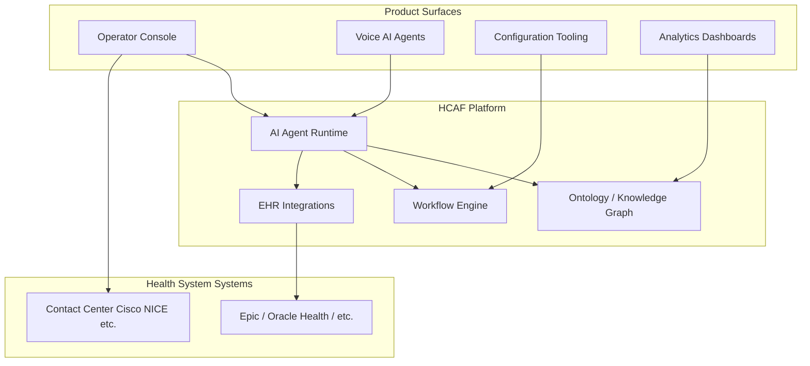

# What is HCAF?

**HCAF** stands for **Healthcare AI Fabric** — the proprietary intelligence platform built by [SpinSci Technologies](https://spinsci.ai/) that powers their healthcare AI agents and product surfaces.

This document provides company and platform context for the Full-Stack / Product Engineer exercise. Understanding who HCAF is and what they build is essential for framing architecture trade-offs in stakeholder conversations.

---

## SpinSci in one paragraph

SpinSci builds AI-powered tools for **health-system patient access and hospital operations**. Their customers are hospitals and health systems that run contact centers, operator switchboards, and patient-facing workflows integrated with EHRs (Epic, Oracle Health, athenahealth, etc.). SpinSci's products help human operators and AI agents work together during live patient interactions — routing calls, looking up providers, checking eligibility, scheduling, and escalating to humans when needed.

---

## What HCAF (Healthcare AI Fabric) is

HCAF is **not a product end-users buy on its own**. It is the **platform layer underneath** SpinSci's AI agents and interfaces — the "fabric" that connects:

| HCAF responsibility | What it means |
|----------------------|---------------|
| **EHR integration** | Reads and writes real patient data from Epic, Oracle Health, etc. — not approximations |
| **Knowledge graph** | Converts EHR decision logic and operational data into an AI-ready foundation |
| **Ontology / domain model** | Defines healthcare entities (patient, provider, eligibility, payer…) and how they relate |
| **Agent orchestration** | Powers AI agents that reason through patient intent and follow health-system workflow rules |
| **Workflow logic** | Encodes scheduling rules, provider directories, on-call schedules, escalation paths |

Think of HCAF as the **brain and nervous system**; products like the Operator Console are the **surfaces humans interact with**.

---

## Key SpinSci products (product surfaces)

| Product | Who uses it | What it does |
|---------|-------------|--------------|
| **Operator Console (OC)** | Hospital switchboard / contact center operators | Unified screen during live calls: patient lookup, provider directory, call routing, paging, on-call schedules, agent recommendations |
| **Voice AI Agents** | Patients (phone) + operators (escalation) | AI handles scheduling, billing questions, prescription requests; escalates to human with full context |
| **Clinical Communications** | Hospital operators | Code calls, overhead pages, secure messaging, staff lookup |
| **AI Switchboard** | Hospital contact centers | AI-driven call routing to the right destination first time |

The exercise focuses on building architecture for the **product-surface platform** that all these interfaces share — starting with the Operator Console as the hardest case (dense data, live calls, seconds matter).

---

## Why the exercise exists

HCAF's domain is unusually dynamic:

- **Ontology evolves** — new payers, workflows, entity types added frequently
- **Data is dense** — operators see patient, provider, eligibility, and agent output simultaneously
- **Latency is critical** — during a live call, UI must update in seconds, not after a deploy
- **Multiple surfaces, no shared pattern yet** — Operator Console, config tooling, and analytics each grew independently
- **No professional-grade design system** — visual consistency across surfaces is an open problem

The exercise asks you to **propose an architecture** — not build production software — and then discuss it across **multiple stakeholder calls** (Commercial, Product, AI, Engineering). They are evaluating:

1. Can you reason through trade-offs without claiming one correct answer?
2. Can you communicate a coherent technical vision?
3. Can you help them navigate SDUI, low-code, hardcoded React, and other UI approaches?

---

## HCAF-specific terms you'll hear

| Term | Meaning |
|------|---------|
| **Operator Console (OC)** | The primary UI for hospital staff during live calls |
| **Agent / AI co-worker** | HCAF-powered AI that handles or assists with patient interactions |
| **Ontology** | Canonical model of healthcare entities and relationships (see [ONTOLOGY.md](./ONTOLOGY.md)) |
| **Product surface** | Any user-facing interface: OC, config tools, analytics, voice UI |
| **Server-Driven UI (SDUI)** | Backend sends UI structure; frontend renders without redeploying for every change |
| **EHR** | Electronic Health Record (Epic, Oracle Health, etc.) — system of record for patient data |
| **Patient access** | Scheduling, referrals, billing, eligibility — the workflows SpinSci automates |

---

## How this context shapes our architecture proposal

| HCAF reality | Architectural implication |
|--------------|---------------------------|
| EHR data shape varies by health system | Ontology layer must be versioned and extensible, not hardcoded TypeScript types |
| Agents produce recommendations mid-call | Real-time transport (WebSocket) with bidirectional operator actions |
| Multiple product surfaces coming | Shared design system (`@hcaf/ui`) + thin SDK (`@hcaf/surface-sdk`) |
| Workflows change weekly | SDUI with generic primitives — schema changes without frontend releases |
| Operators need density + speed | Compact design tokens, virtualized tables, JSON Patch for incremental updates |

---

## Sources

- [SpinSci — Healthcare AI Fabric](https://spinsci.ai/ai-fabric)
- [SpinSci — Operator Console / Clinical Communications](https://spinsci.ai/solutions/clinical-communications)
- [SpinSci — Voice AI Agents](https://spinsci.ai/solutions/voice-ai)

> **Note for the exercise:** HCAF is SpinSci's internal platform name. In your stakeholder conversations, demonstrate that you understand their domain (healthcare operations, live calls, EHR integration) even if you don't know every product detail — ask clarifying questions about their specific ontology evolution cadence and surface roadmap.

---

## Related documents

- [DISCUSSION_GUIDE.md](./DISCUSSION_GUIDE.md) — multi-stakeholder call playbook (**start here for interviews**)
- [ARCHITECTURE_PROPOSAL.md](./ARCHITECTURE_PROPOSAL.md) — full platform architecture proposal
- [TRADEOFFS.md](./TRADEOFFS.md) — ADR-style trade-off records
- [ONTOLOGY.md](./ONTOLOGY.md) — ontology layer explained
