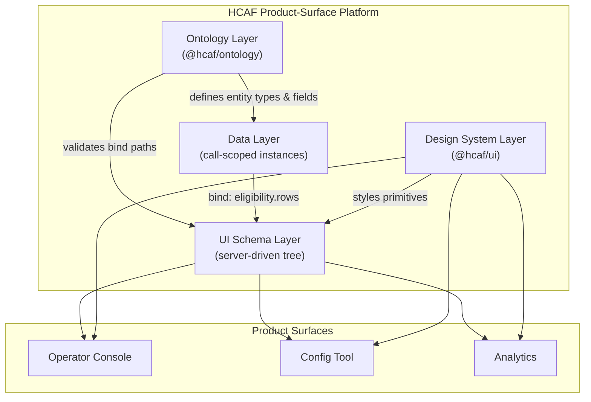
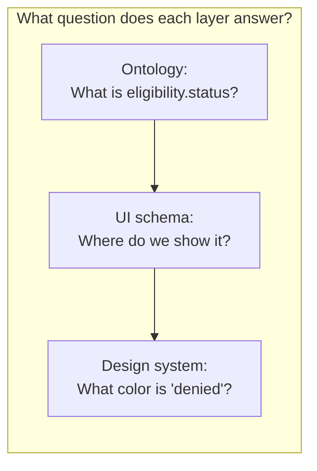

# Ontology in the HCAF Product-Surface Platform

This document explains **what ontology means** in the HCAF exercise context, **why it matters** for the Operator Console, and **how our architecture and PoC incorporate it**.

---

## 1. What is an ontology?

In plain terms, an **ontology** is a **formal description of the concepts in a domain and how they relate to each other**.

> **Company context:** HCAF (Healthcare AI Fabric) is SpinSci's platform for healthcare AI agents. See [HCAF.md](./HCAF.md) for full background.

It answers questions like:

- What **entity types** exist? (e.g. Patient, Provider, Payer, Eligibility)
- What **fields** does each entity have? (e.g. Patient has `name`, `dob`, `memberId`)
- What **relationships** exist between entities? (e.g. Patient *has* Eligibility *with* Payer)
- What are the **allowed values** and **constraints**? (e.g. `status` is one of `active | pending | denied`)

### Analogy

Think of ontology as the **database schema of meaning** — not the actual data in a call, but the **rules for what kinds of things can exist** and how they connect.

| Layer | Question it answers | Example |
|-------|---------------------|---------|
| **Ontology** | What *can* exist? | "Eligibility has fields: payer, status, copay, effectiveDate" |
| **Data (instances)** | What *does* exist right now? | "John's Aetna eligibility is active, copay $25" |
| **UI schema** | How do we *show* it? | "Render a DataTable bound to `eligibility.rows`" |
| **Design system** | How does it *look*? | Compact table, status badges, HCAF color tokens |

### In healthcare / HCAF specifically

HCAF agents work with fast-changing healthcare concepts during live calls:

- Patient demographics and identifiers
- Provider and facility information
- Insurance eligibility and benefits
- Prior authorization requirements
- Agent-generated recommendations and next steps

The exercise states that **"the underlying data shape is not fixed; the ontology evolves, and new workflow types are added frequently."** That means:

- A new payer integration might add fields like `planTier` or `networkType`
- A new workflow (e.g. prior auth) might introduce an entirely new entity: `PriorAuth`
- Agent outputs may reference concepts that did not exist when the frontend was last deployed

**Ontology is the contract that lets the platform evolve without breaking every screen.**

---

## 2. Why ontology is central to this exercise

The Operator Console problem has three pressures that all touch ontology:

### Pressure 1: Dense, fast-changing data

During a live call, operators see dozens of fields updating in seconds. The UI must know **which fields exist**, **what type they are**, and **how to label them** — even when the backend adds a new one mid-week.

### Pressure 2: Server-driven UI (no redeploy per change)

If every new field required a React code change and a frontend release, HCAF could not keep up with evolving workflows. The platform needs:

1. Ontology to declare **what** new data exists
2. UI schema to declare **where** it appears on screen
3. Generic renderers to display **unknown-but-typed** fields safely

### Pressure 3: Multiple product surfaces

Operator Console, configuration tooling, and analytics dashboards all need to speak the same language about entities. Without a shared ontology:

- The console might call it `memberId` while analytics calls it `patient_id`
- A new workflow step might render in the console but be invisible in reports
- Agent recommendations would not map consistently to UI actions

**Ontology is the shared vocabulary across all HCAF product surfaces.**

---

## 3. How ontology fits in our architecture

We use a **four-layer model**. Ontology is the foundation; it is intentionally separate from UI and styling.



### Layer responsibilities

| Layer | Package / service | Owns | Does not own |
|-------|-------------------|------|--------------|
| **Ontology** | `@hcaf/ontology` + `GET /v1/ontology` | Entity types, field definitions, relationships, version | Layout, colors, call-specific values |
| **Data** | NestJS call state store | Instance values for an active call | How fields are displayed |
| **UI schema** | NestJS schema API + `@hcaf/surface-sdk` | Component tree, `bind` paths, layout | Entity definitions |
| **Design system** | `@hcaf/ui` | Visual primitives, density, a11y | Business data shape |

### The `bind` path — how layers connect

UI schema nodes reference ontology data through **bind paths** (dot-notation into the call data object):

```json
{
  "type": "DataTable",
  "bind": "eligibility.rows",
  "props": {
    "columns": ["payer", "status", "copay"]
  }
}
```

- `eligibility.rows` must exist in the **ontology** (as an entity or collection on Patient/Call)
- The **data layer** provides the actual rows for this call
- The **UI schema** decides to render them as a table
- The **design system** controls table density, badge colors for `status`, etc.

The SDK validates that `bind` paths resolve against the declared **ontology version** before rendering.

---

## 4. Ontology versioning and evolution

Ontology is **versioned**, like an API:

```json
{
  "version": "1.2.0",
  "entities": {
    "Patient": {
      "fields": {
        "name": { "type": "string", "label": "Patient Name" },
        "memberId": { "type": "string", "label": "Member ID" },
        "dob": { "type": "date", "label": "Date of Birth" }
      }
    },
    "Eligibility": {
      "fields": {
        "payer": { "type": "string" },
        "status": { "type": "enum", "values": ["active", "pending", "denied"] },
        "copay": { "type": "currency" }
      }
    }
  }
}
```

### Two common evolution scenarios

#### Scenario A: New field on an existing entity

*Example: payer integration adds `planTier` to Eligibility.*

| Step | Action | Frontend deploy needed? |
|------|--------|-------------------------|
| 1 | Bump ontology to `1.2.0`, add `planTier` field | No |
| 2 | Push UI schema update: add column to DataTable | No |
| 3 | Agent/data layer starts sending `planTier` values | No |

Generic `DataTable` and `Field` primitives render the new column automatically.

#### Scenario B: New entity type for a new workflow

*Example: prior authorization workflow introduces `PriorAuth` entity.*

| Step | Action | Frontend deploy needed? |
|------|--------|-------------------------|
| 1 | Extend ontology with `PriorAuth` entity + fields | No |
| 2 | Push UI schema: new `Panel` with `Field` children bound to `priorAuth.*` | No |
| 3 | If layout is complex, add a domain composite to the component registry | Optional (lazy chunk) |

The PoC demonstrates Scenario B via the **workflow engine**: when a new module surfaces, `OntologyService.extendWithStep()` merges entity fields and bumps the version. Admin `POST /v1/admin/extend-ontology` is an alias for manual testing.

---

## 5. How ontology is included in our deliverables

### In the architecture proposal (`ARCHITECTURE_PROPOSAL.md`)

- **Problem framing** — explains why evolving data shape is the root constraint
- **Tech choices** — ontology registry approach (JSON Schema registry vs graph DB) with trade-offs
- **API/SDK design** — `GET /v1/ontology`, version negotiation, bind-path validation in SDK
- **Deployment** — ontology extension without frontend redeploy
- **Risks** — ontology drift, breaking bind paths, version mismatch between surfaces

### In the trade-offs document (`TRADEOFFS.md`)

**ADR-000: Ontology modeling strategy** compares:

| Approach | Pros | Cons | When to use |
|----------|------|------|-------------|
| **JSON Schema registry** (recommended for PoC) | Simple, versionable, validates data + UI binds | Less expressive for complex relationships | Most HCAF workflows; fast iteration |
| **Graph database (Neo4j)** | Rich relationships, queryable | Ops overhead, harder for frontend consumers | Heavy relationship traversal needs |
| **Protobuf / Avro** | Strong typing, fast serialization | Rigid evolution, poor human readability for UI teams | Service-to-service, not primary UI contract |
| **Hardcoded TypeScript types** | Familiar to engineers | Every change needs code + deploy | Stable, small domain only |

### In the PoC code

| Artifact | Ontology role |
|----------|---------------|
| `packages/ontology` (`@hcaf/ontology`) | Shared types, entity definitions, bind-path helpers |
| `apps/api` — `OntologyModule` | Serves versioned ontology; admin endpoint to extend it |
| `apps/api` — call state | Instance data conforming to current ontology version |
| `packages/surface-sdk` | Resolves `bind` paths; validates against ontology; generic `Field` renderer uses field `type` + `label` from ontology |
| `apps/operator-console` | Renders whatever the ontology + UI schema declare; patient queue + server-driven workflow |

---

## 6. Ontology vs UI schema vs design system

A common point of confusion — here is how we keep them separate:



| Concern | Wrong layer | Right layer |
|---------|-------------|-------------|
| "Add a `planTier` field" | UI schema | **Ontology** |
| "Show eligibility in a table, not a form" | Ontology | **UI schema** |
| "Use compact 12px rows in the console" | Ontology | **Design system** |
| "Status `denied` should be red" | Ontology | **Design system** (semantic token: `status-danger`) |

Keeping these separate is what allows **ontology and UI to evolve independently** while **visual consistency stays centralized** in `@hcaf/ui`.

---

## 7. What we are not claiming

To stay honest about trade-offs (the exercise values this):

- **Ontology does not eliminate all frontend work.** Truly novel visualizations still need new components in the registry.
- **Ontology versioning has a cost.** Surfaces must handle version mismatches gracefully (fallback labels, unknown field types).
- **A JSON Schema registry does not replace a clinical data model.** For production, HCAF would likely align with FHIR or internal canonical models; our PoC uses a simplified registry to demonstrate the *pattern*.
- **Ontology alone does not solve real-time.** It pairs with WebSocket data patches and UI schema pushes — see `ARCHITECTURE_PROPOSAL.md` §4.

---

## 8. Summary

| Concept | Definition in our work |
|---------|----------------------|
| **Ontology** | Versioned catalog of entity types, fields, and relationships in the healthcare domain |
| **Why it matters** | Data shape evolves weekly; operators need correct labels and types without redeploying React |
| **How we include it** | `@hcaf/ontology` package, `/v1/ontology` API, bind-path validation in SDK, admin extend endpoint in PoC |
| **How it connects to SDUI** | UI schema `bind` paths point into ontology-typed data; generic renderers use field metadata |
| **How it connects to design system** | Ontology provides semantics (`status: denied`); design system provides presentation (`Badge` variant `danger`) |

Ontology is not a side note — it is the **reason** server-driven UI exists in this architecture. Without an evolving domain model, hardcoded screens would be simpler. HCAF's constraint is that the domain model **will** change, and the platform must absorb that change at the ontology and schema layers so operators never wait on a frontend release during a live call.

---

## Related documents

- [HCAF.md](./HCAF.md) — what HCAF is and why this exercise exists
- [DISCUSSION_GUIDE.md](./DISCUSSION_GUIDE.md) — multi-stakeholder call playbook
- [ARCHITECTURE_PROPOSAL.md](./ARCHITECTURE_PROPOSAL.md) — full platform architecture
- [TRADEOFFS.md](./TRADEOFFS.md) — ADR-style decision records
