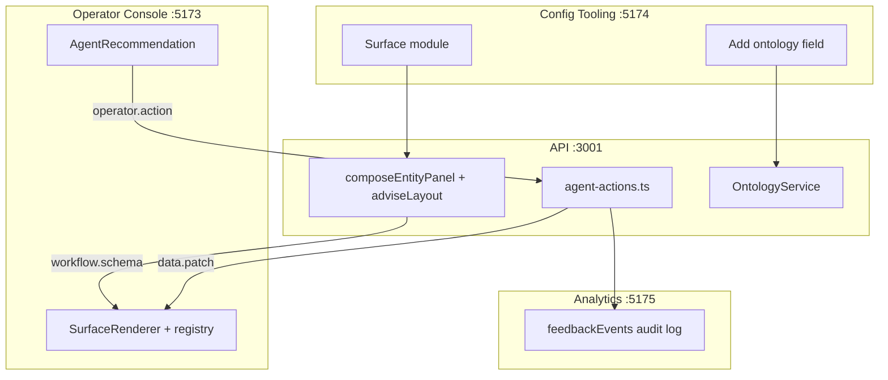

# Server-Driven UI & Agent Governance — Mental Model

This document is the **authoritative explanation** of what SDUI is meant to avoid, how the component registry works, when code changes are actually needed, and how the **agent recommendation** flow (approve / override / audit) fits the architecture.

Related: [SCHEMA_COMPOSITION.md](./SCHEMA_COMPOSITION.md) (composition pipeline), [APP_FLOW_SLIDES.md](./APP_FLOW_SLIDES.md) (demo walkthrough), [ARCHITECTURE_PROPOSAL.md](./ARCHITECTURE_PROPOSAL.md) (full system design).

---

## 1. What SDUI is meant to avoid

**No Operator Console redeploy** when:

| Change | Example | Mechanism |
|--------|---------|-----------|
| New payer workflow | Prior auth, COB, pharmacy | Server composes panel → `workflow.schema` push |
| New fields on an entity | `planTier`, `authNumber` | Ontology extend + panel re-compose |
| Layout change | Table vs stats vs timeline | `adviseLayout()` picks strategy from data shape |
| Brand-new workflow for a health system | Novel entity never seen before | `field-grid` fallback + generic primitives |

The server sends JSON; the console renders it. That is the **weekly-change path** HCAF cares about.

SDUI does **not** mean zero frontend work ever. It means **workflow and ontology changes do not block operators on live calls.**

---

## 2. Correct mental model

```
CODE (rare, shared)              CONFIG (frequent, per workflow)
─────────────────────            ─────────────────────────────────
@hcaf/ui primitives              Ontology fields
@hcaf/surface-sdk registry       Entity instance data
~15 component types              Layout advisor rules
                                 Composed UI schema JSON
                                          ↓
                                 Operator Console (never redeployed)
```

### Three product surfaces (same platform)

| Surface | URL | Role |
|---------|-----|------|
| **Operator Console** | `:5173` | Live calls — compact density, WebSocket, approve/override |
| **Config Tooling** | `:5174` | Surface modules, extend ontology, preview composition |
| **Analytics** | `:5175` | Read-only cross-call metrics + operator override audit log |

All three consume the same API and `@hcaf/ui`. Config pushes changes; Operator Console receives them live; Analytics observes outcomes.

---

## 3. The registry is not "one component per workflow"

Think of it like **HTML**, not like **one React page per screen**:

| HTML | HCAF registry |
|------|----------------|
| `<table>`, `<input>`, `<progress>` | `DataTable`, `Field`, `StatGrid`, `Timeline`, `Alert`… |
| You don't ship new HTML tags per form | You don't ship new React per workflow |

The registry is a **small, stable vocabulary** of generic primitives. Workflows are **composed** from them at runtime — `composeEntityPanel()` + `adviseLayout()` in [SCHEMA_COMPOSITION.md](./SCHEMA_COMPOSITION.md).

Registered types in the PoC (`packages/surface-sdk/src/renderer.tsx`): `Stack`, `Grid`, `Split`, `Field`, `WorkflowCard`, `StatGrid`, `DataTable`, `Timeline`, `CobFlow`, `Alert`, `ProgressPanel`, `PatientHeader`, `EligibilityTable`, `AgentRecommendation`, and fallbacks.

---

## 4. Brand-new entity — zero frontend change

When entity data arrives that the platform has never seen:

```
New entity data arrives (any scalar fields)
       ↓
adviseLayout() → field-grid fallback
  (or cob-flow, timeline, tabular-with-summary if shape matches)
       ↓
StatGrid + Field grid auto-built from data + ontology
       ↓
Operator Console renders via existing registry
```

You do **not** need a new component type for "Transport Benefit" or "Prior Auth v2" if the data fits existing patterns.

Preview any module: `GET /v1/schema/compose/:moduleId`

---

## 5. When code changes are actually needed

| Situation | Code change? | How often |
|-----------|--------------|-----------|
| New workflow / entity / fields | **No** — config + server compose | Weekly |
| New field on existing entity | **No** — ontology push via Config Tooling | Weekly |
| Data shape triggers existing strategy (`history[]` → Timeline, `rows[]` → DataTable) | **No** | Common |
| Novel visualization nothing in registry can express (e.g. interactive prior-auth flowchart) | **Yes** — one new registry entry, reused everywhere | Rare |

**ADR trade-off:** schema push covers **90%+** of changes; registry additions are an occasional escalation, not per workflow. See [TRADEOFFS.md](./TRADEOFFS.md) ADR-006.

---

## 6. `eligibility-workflow.ts` is PoC mock data — not the architecture

In production, workflow definitions would **not** live as TypeScript. They would be:

- Workflow definitions in a **config store** (DB / Git), or
- Surfaced by the **agent runtime** when it detects a blocker during a call

The PoC hardcodes 10 modules in `apps/api/src/workflows/eligibility-workflow.ts` as **seed data** to simulate "new entity data arrived." The **composition pipeline** is what matters — and that pipeline is data-driven.

**Config Tooling** (`POST /v1/config/surface-module`) is the intentional demo path: pick a module → server composes UI → Operator Console updates. No deploy.

### Config API (PoC)

| Method | Endpoint | Purpose |
|--------|----------|---------|
| `POST` | `/v1/config/surface-entity` | Surface a **brand-new** entity type (demo catalog) |
| `GET` | `/v1/config/demo-entities` | List demo entities with ontology/layout explanations |
| `POST` | `/v1/config/ontology/field` | Add field to entity + push to call |
| `GET` | `/v1/schema/compose/:moduleId` | Preview composed schema + layout reasoning |

---

## 7. Agent recommendation — purpose and governance

### 7.1 Why it exists

During a live call, HCAF's AI agent detects blockers and proposes actions. The agent does **not** act autonomously on production paths — a **human operator** must decide.

The **Agent Recommendation** panel answers:

| Field | Meaning |
|-------|---------|
| `text` | What the AI noticed |
| `confidence` | How sure the model is |
| `action` | What it suggests doing |
| `status` | `monitoring` → `pending` → `executing` → `approved` \| `overridden` |

The **workflow panel** shows **data** (what is on file). The **agent panel** shows **judgment** (what to do) and waits for a decision.

### 7.2 Approve vs Override (acceptance vs rejection)

| Operator action | Meaning | Server behavior |
|-----------------|---------|-----------------|
| **Approve** | Accept the agent's recommendation | `agent-actions.ts` executes scenario handler (submit PA, update status, etc.), re-composes panel, sets `status: approved` |
| **Override** | **Reject** the recommendation — operator disagrees | Requires **feedback text** (min 3 chars); logs to `agent.feedbackLog`; applies override handler (waive PA, waive referral, etc.); sets `status: overridden` + `outcome` |

**Override is rejection with accountability.** In stakeholder language: human-in-the-loop governance, not a cosmetic button.

Override without feedback is **rejected server-side** — the operator must explain why they disagreed with the AI.

### 7.3 Workflow pause (governance gate)

While `agent.latest.status === 'pending'`, the workflow engine **pauses** for that call. The next module does not surface until the operator approves or overrides.

This models real hospital operations: AI proposes, human decides, audit trail captures disagreements.

### 7.4 Audit trail

Override events are stored on the call:

```json
{
  "scenario": "priorAuth",
  "reason": "Patient already has PA on file from last visit",
  "originalAction": "Submit prior auth request",
  "at": "2026-07-23T19:12:00.000Z"
}
```

- **Operator Console:** `state.agent.feedbackLog`
- **Analytics** (`:5175`): `GET /v1/analytics/summary` → `feedbackEvents` (cross-call view)

Approve actions are not logged to `feedbackLog` in the PoC; production would likely log both for full compliance.

### 7.5 End-to-end agent flow

```
Workflow module surfaces (composed panel + entity data)
       ↓
agent.latest → status: pending (recommendation visible)
       ↓
Workflow PAUSED for this call
       ↓
Operator → Approve                    Operator → Override + reason
       ↓                                       ↓
agent-actions.ts (approve handler)     agent-actions.ts (override handler)
       ↓                                       ↓
Entity state updated                   feedbackLog entry + entity updated
Panel re-composed                      Panel re-composed
       ↓                                       ↓
WebSocket: workflow.schema + data.patch + platform.notice
       ↓
~3s later: next module may surface
```

**Client contract:**

```json
// Client → server
{ "action": "approve" }
{ "action": "override", "feedback": "Patient already has auth on file" }

// Server → client
{ "type": "agent.recommendation", "payload": { "text", "confidence", "action", "status", "outcome?" } }
```

The UI does **not** optimistically flip buttons — the server pushes authoritative state after execution.

---

## 8. How the pieces connect (one diagram)



---

## 9. Demo script (prove the model)

1. Open **Config Tooling** → Surface `priorAuth` on `call-maria`.
2. Open **Operator Console** → see composed panel appear (no redeploy).
3. Wait for agent **pending** → click **Override** → enter reason → submit.
4. Open **Analytics** → see override in feedback log with `moduleId`, `feedback`, `timestamp`.
5. In Config Tooling → add field `planTier` to `priorAuth` → panel re-composes on live call.

---

## Related documents

- [SCHEMA_COMPOSITION.md](./SCHEMA_COMPOSITION.md) — layout advisor + composer pipeline
- [APP_FLOW_SLIDES.md](./APP_FLOW_SLIDES.md) — slide deck walkthrough
- [ONTOLOGY.md](./ONTOLOGY.md) — four-layer model and bind paths
- [DISCUSSION_GUIDE.md](./DISCUSSION_GUIDE.md) — stakeholder playbook (AI call focuses on agent contract)
- [TRADEOFFS.md](./TRADEOFFS.md) — ADR records for SDUI, registry, deploy model
